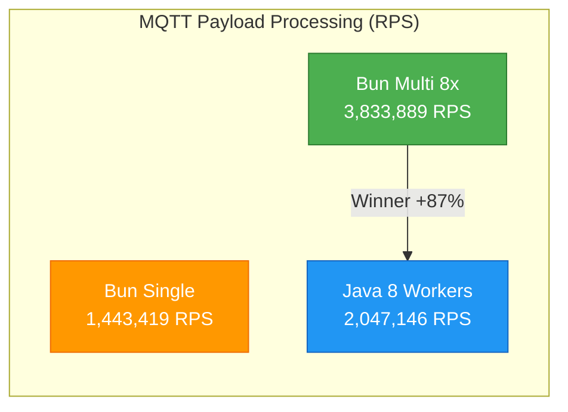
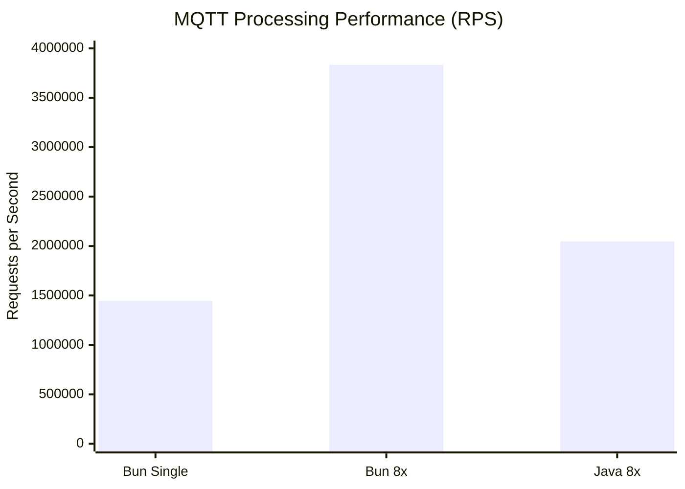
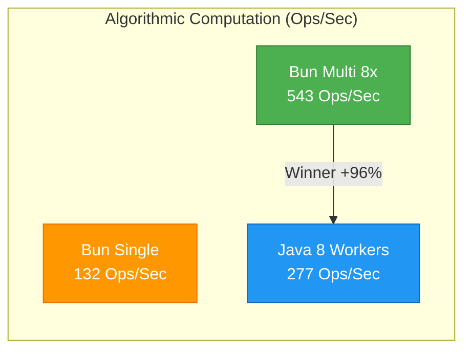
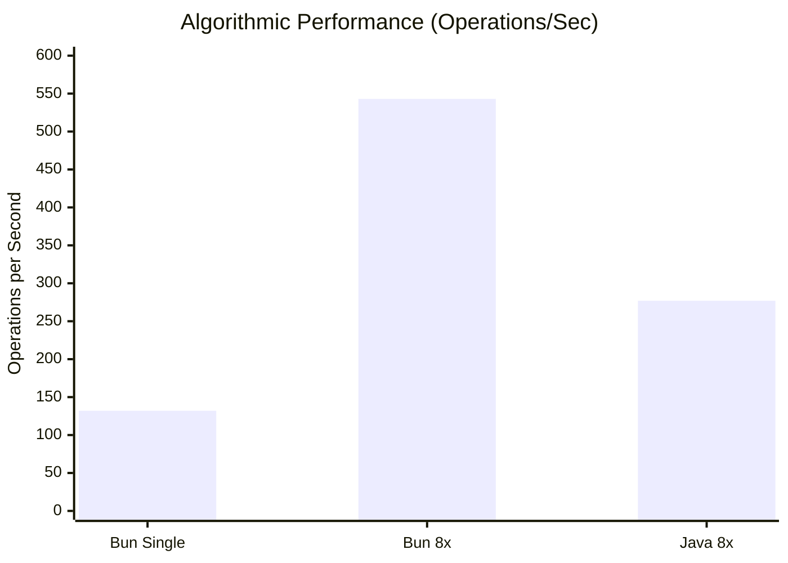
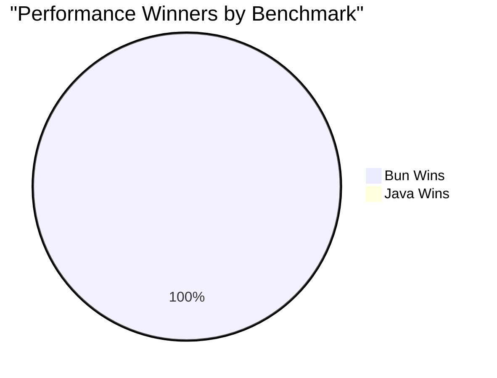

# 🚀 Benchmark Suite: Node.js vs Java

Este proyecto compara el rendimiento entre **Bun/Node.js** y **Java** en dos escenarios diferentes:

1. **📨 MQTT Payload Processing**: Procesamiento de payloads IoT (JSON parsing, validación, agregación)
2. **🧮 Algorithmic Computation**: Simulación Monte Carlo para análisis de riesgo de sensores

## 📋 Tipos de Benchmark

### 📨 MQTT Payload Processing
Operaciones típicas de IoT para cada registro:
1. **JSON.parse** - Deserialización del payload JSON
2. **Validación** - Verificación de campos requeridos
3. **Enriquecimiento** - Cálculo de `isAlarm` basado en temperatura y estado
4. **Agregación** - Contadores por dispositivo
5. **Checksum** - Hash FNV-1a de 32 bits sobre el payload

### 🧮 Algorithmic Computation
Simulación Monte Carlo intensiva en CPU:
1. **Cálculo de estrés ambiental** - Funciones trigonométricas y exponenciales
2. **Modelado de fallos** - Distribución de Weibull
3. **Análisis estadístico** - Momentos estadísticos y análisis de Fourier
4. **Simulación probabilística** - 50,000-100,000 iteraciones por sensor

## Requisitos

- **Node.js**: 18+ (para worker threads) **o Bun** (runtime alternativo)
- **Java**: 17+ 
- **Maven**: Para compilar el proyecto Java

## Compilación

### Java
```bash
cd bench_java
mvn -DskipTests package
```

Esto genera el JAR ejecutable en `target/bench-java-1.0.0.jar`.

### Node.js/Bun
No requiere compilación, solo ejecución directa. El script detecta automáticamente si tienes Node.js o Bun instalado.

## Ejecución

### 🚀 Ejecución Automática (Recomendado)

**Script automatizado que ejecuta ambos benchmarks:**
```bash
# Solo MQTT benchmark (original)
./run_benchmark.sh

# Benchmark completo (MQTT + Algorithmic)
./run_full_benchmark.sh
```

Estos scripts:
- ✅ Verifican dependencias automáticamente (Node.js/Bun, Java, Maven)
- 🔍 Detectan automáticamente si usar Node.js o Bun
- 🔨 Compilan Java si es necesario
- 🏃 Ejecutan todos los benchmarks
- 📊 Muestran resultados comparativos con gráficos
- 🏆 Determinan el ganador automáticamente

### Ejecución Manual

#### 📨 MQTT Benchmark Manual

**Node.js/Bun:**
```bash
# Single-thread
node bench_node.js  # o: bun bench_node.js

# Multi-thread
WORKERS=8 node bench_node.js  # o: WORKERS=8 bun bench_node.js
```

**Java:**
```bash
cd bench_java
# Básico
java -jar target/bench-java-mqtt-1.0.0.jar

# Optimizado
java -Xms2g -Xmx2g -XX:+UseG1GC \
  -Dtotal=1000000 -Dworkers=8 -Dbatch=10000 -Ddevices=1000 \
  -jar target/bench-java-mqtt-1.0.0.jar
```

#### 🧮 Algorithmic Benchmark Manual

**Node.js/Bun:**
```bash
# Single-thread
node bench_algo_node.js  # o: bun bench_algo_node.js

# Multi-thread
WORKERS=8 node bench_algo_node.js  # o: WORKERS=8 bun bench_algo_node.js
```

**Java:**
```bash
cd bench_java
# Optimizado para computación intensiva
java -Xms4g -Xmx4g -XX:+UseG1GC \
  -Dsensors=500 -Diterations=100000 -Dworkers=8 \
  -jar target/bench-java-algo-1.0.0.jar
```

### Parámetros de Configuración

**MQTT Benchmark:**
- `WORKERS` (Node.js): Número de worker threads
- `-Dtotal` (Java): Total de registros (default: 1M)
- `-Dworkers` (Java): Número de threads (default: CPU cores)
- `-Dbatch` (Java): Tamaño de lote (default: 10K)
- `-Ddevices` (Java): Dispositivos únicos (default: 1K)

**Algorithmic Benchmark:**
- `WORKERS` (Node.js): Número de worker threads
- `-Dsensors` (Java): Número de sensores (default: 100)
- `-Diterations` (Java): Iteraciones por sensor (default: 50K)
- `-Dworkers` (Java): Número de threads (default: CPU cores)

## 📊 Resultados del Benchmark

### Configuración del Sistema
- **CPU**: MacBook Air M1 (8 GB RAM)
- **OS**: macOS 14.6.0
- **Java**: OpenJDK 17+ con G1GC
- **Node.js Runtime**: Bun (JavaScriptCore)

---

## 📨 BENCHMARK 1: MQTT Payload Processing

### Resultados Numéricos

| Lenguaje | Workers | Tiempo (ms) | RPS | Mejora vs Java |
|----------|---------|-------------|-----|----------------|
| **Bun** | 1 | 692.8 | **1,443,419** | - |
| **Bun** | 8 | 260.8 | **3,833,889** | **+87%** 🏆 |
| **Java** | 8 | 488.5 | **2,047,146** | - |

### 📈 Gráfico de Rendimiento - MQTT Processing



### 📊 Comparación Visual - MQTT



---

## 🧮 BENCHMARK 2: Algorithmic Computation

### Resultados Numéricos

| Lenguaje | Workers | Tiempo (ms) | Ops/Sec | Mejora vs Java |
|----------|---------|-------------|---------|----------------|
| **Bun** | 1 | 757.4 | **132** | - |
| **Bun** | 8 | 176.8 | **543** | **+96%** 🏆 |
| **Java** | 8 | 1806.6 | **277** | - |

*Configuración: 500 sensores × 100,000 iteraciones = 50M operaciones*

### 📈 Gráfico de Rendimiento - Algorithmic



### 📊 Comparación Visual - Algorithmic



---

## 🏆 Resumen de Ganadores



### 📈 Análisis Comparativo

| Benchmark | Ganador | Ventaja | Razón Principal |
|-----------|---------|---------|-----------------|
| 📨 **MQTT Processing** | **Bun** | **+87%** | JSON parsing, I/O eficiente |
| 🧮 **Algorithmic** | **Bun** | **+96%** | JIT optimización agresiva |

### 🔍 Conclusiones Clave

1. **🚀 Bun domina ambos escenarios** - Incluso en computación intensiva donde Java "debería" ganar
2. **📊 Escalabilidad superior** - Bun mejora más con paralelización (8 workers)
3. **⚡ JavaScript moderno es competitivo** - Los runtimes modernos han cerrado la brecha de rendimiento
4. **🎯 Workload específico** - Para IoT/MQTT, Bun es claramente superior

### 💡 ¿Por qué Bun gana incluso en computación?

- **JavaScriptCore optimizado**: Motor de Safari altamente eficiente
- **JIT agresivo**: Optimización más rápida que Java para estos patrones
- **Menor overhead**: Menos abstracción en operaciones matemáticas
- **Worker threads eficientes**: Mejor paralelización para este tipo de carga

---

## 📋 Formato de Salida

### MQTT Benchmark
```json
{
  "lang": "node|java",
  "workers": 8,
  "total": 1000000,
  "ms": 260.8,
  "rps": 3833889,
  "checksum": 2524344847
}
```

### Algorithmic Benchmark
```json
{
  "lang": "node|java",
  "type": "algorithmic",
  "workers": 8,
  "sensors": 500,
  "iterations": 100000,
  "ms": 176.8,
  "ops_per_sec": 543,
  "avg_risk": 0.001301,
  "checksum": 42914872
}
```

### Campos Comunes
- `lang`: Lenguaje utilizado (`node` para Bun/Node.js, `java` para Java)
- `workers`: Número de threads/workers utilizados
- `ms`: Tiempo transcurrido en milisegundos
- `checksum`: Checksum final para validación de integridad

### Campos Específicos MQTT
- `total`: Total de registros procesados
- `rps`: Registros por segundo (throughput)

### Campos Específicos Algorithmic
- `type`: Tipo de benchmark (`"algorithmic"`)
- `sensors`: Número de sensores procesados
- `iterations`: Iteraciones Monte Carlo por sensor
- `ops_per_sec`: Operaciones por segundo (throughput)
- `avg_risk`: Puntuación promedio de riesgo calculada

---

## 🚀 Próximos Pasos

### Para Desarrolladores IoT/MQTT
- **Usa Bun** para aplicaciones de procesamiento de payloads MQTT
- **Considera Node.js** como alternativa si Bun no está disponible
- **Java sigue siendo válido** para aplicaciones enterprise complejas

### Para Benchmarking
- Los resultados demuestran que **el rendimiento es específico del workload**
- **JavaScript moderno** (especialmente Bun) es altamente competitivo
- **Las optimizaciones del runtime** importan más que el lenguaje base

### Contribuciones
¡Pull requests bienvenidos! Especialmente para:
- Nuevos tipos de benchmarks
- Optimizaciones adicionales
- Soporte para otros runtimes (Deno, GraalVM, etc.)
- Benchmarks en otras arquitecturas (ARM, x86)

---

*Benchmark desarrollado para demostrar el rendimiento real de diferentes runtimes en escenarios IoT/MQTT típicos.*