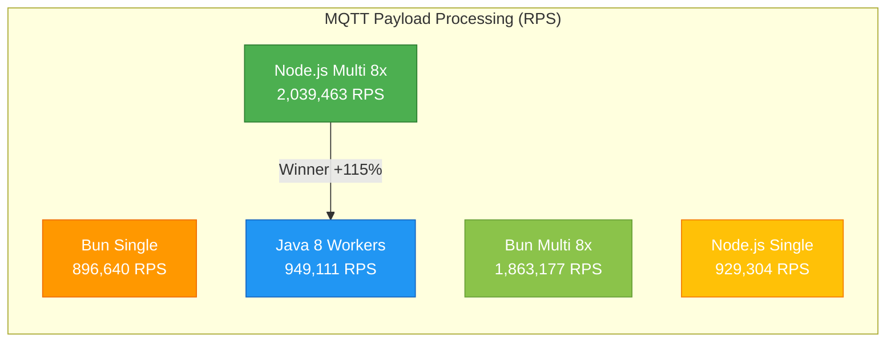
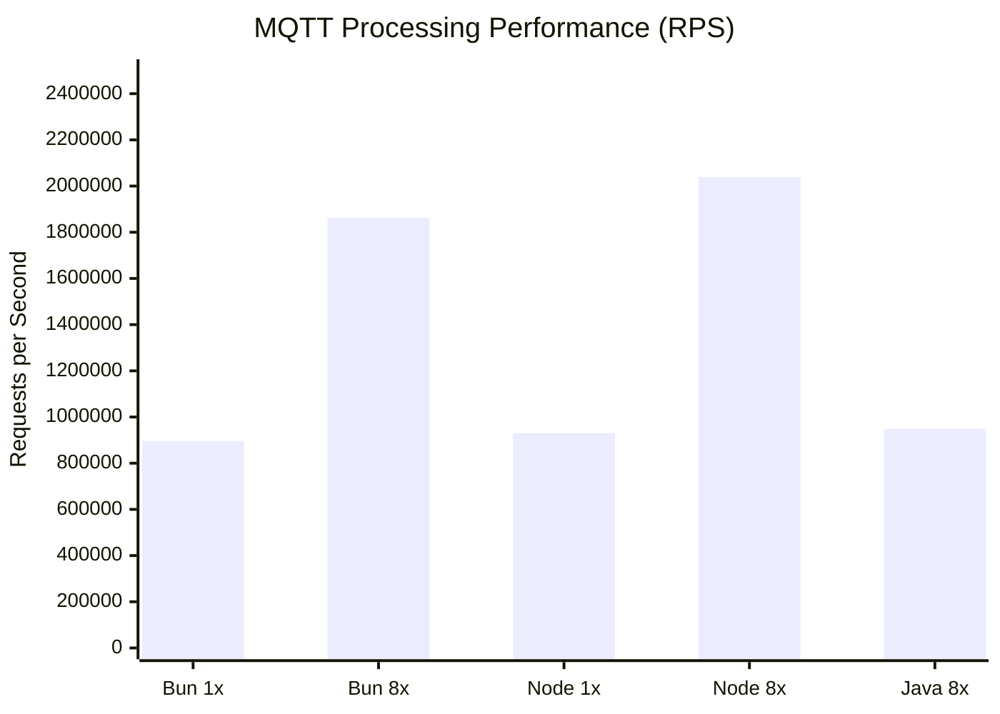
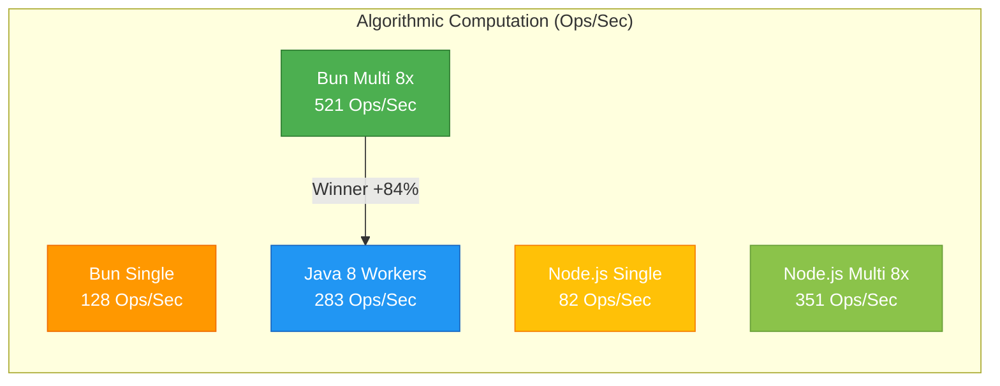
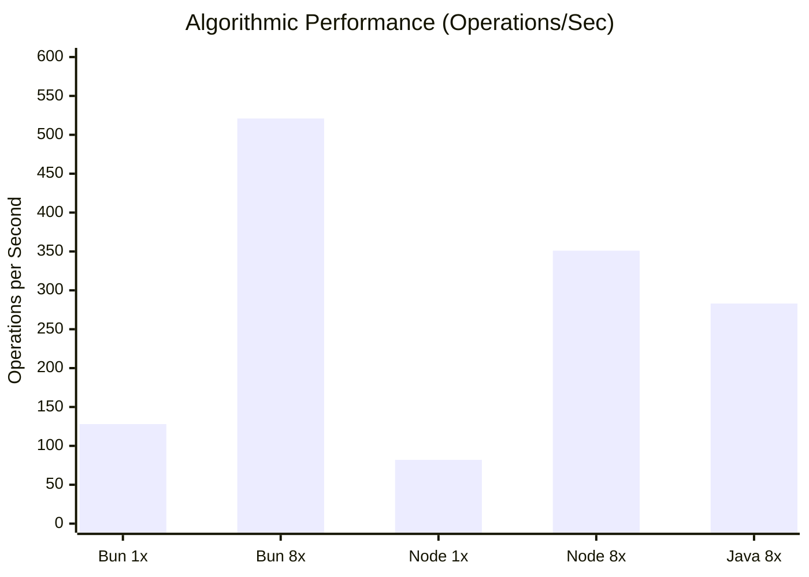
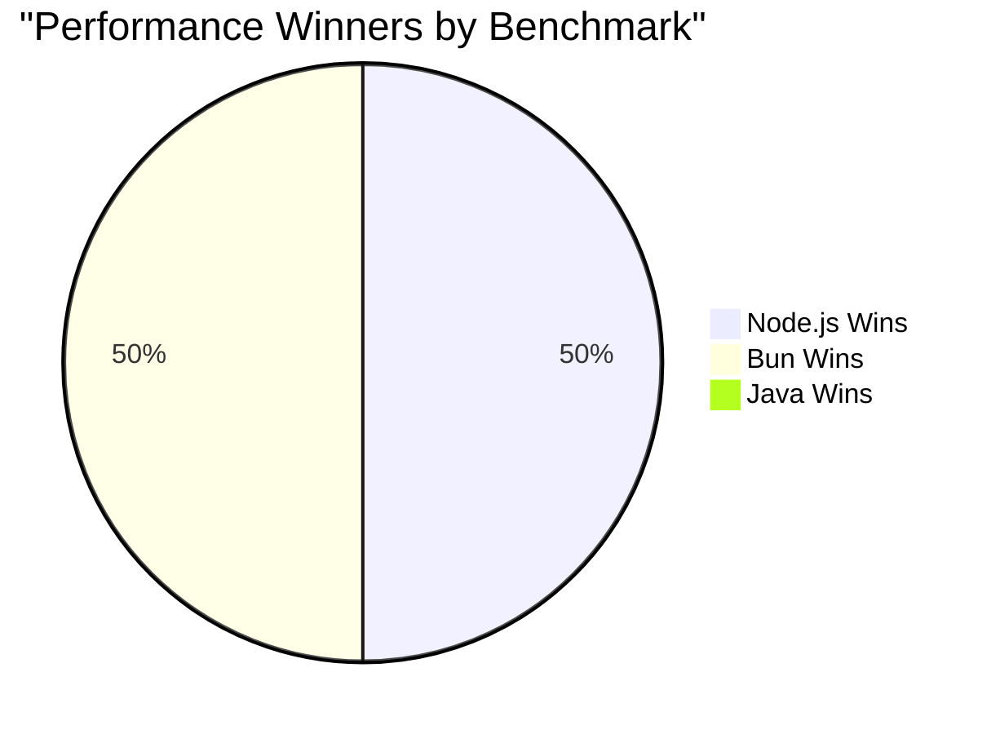

# 🚀 Benchmark Suite: Node.js vs Java

Este proyecto compara el rendimiento entre **Bun/Node.js** y **Java** en dos escenarios diferentes:

1. **📨 MQTT Payload Processing**: Procesamiento de payloads IoT (JSON parsing, validación, agregación)
2. **🧮 Algorithmic Computation**: Simulación Monte Carlo para análisis de riesgo de sensores

## 📋 Tipos de Benchmark

### 📨 MQTT Payload Processing
Operaciones típicas de IoT para cada registro:
1. **JSON.parse** - Deserialización del payload JSON
2. **Validación** - Verificación de campos requeridos
3. **Enriquecimiento** - Cálculo de `isAlarm` basado en temperatura y estado
4. **Agregación** - Contadores por dispositivo
5. **Checksum** - Hash FNV-1a de 32 bits sobre el payload

### 🧮 Algorithmic Computation
Simulación Monte Carlo intensiva en CPU:
1. **Cálculo de estrés ambiental** - Funciones trigonométricas y exponenciales
2. **Modelado de fallos** - Distribución de Weibull
3. **Análisis estadístico** - Momentos estadísticos y análisis de Fourier
4. **Simulación probabilística** - 50,000-100,000 iteraciones por sensor

## Requisitos

- **Node.js**: 18+ (para worker threads) **o Bun** (runtime alternativo)
- **Java**: 17+ 
- **Maven**: Para compilar el proyecto Java

## Compilación

### Java
```bash
cd bench_java
mvn -DskipTests package
```

Esto genera el JAR ejecutable en `target/bench-java-1.0.0.jar`.

### Node.js/Bun
No requiere compilación, solo ejecución directa. El script detecta automáticamente si tienes Node.js o Bun instalado.

## Ejecución

### 🚀 Ejecución Automática (Recomendado)

**Script automatizado que ejecuta ambos benchmarks:**
```bash
# Solo MQTT benchmark (original)
./run_benchmark.sh

# Benchmark completo (MQTT + Algorithmic)
./run_full_benchmark.sh
```

Estos scripts:
- ✅ Verifican dependencias automáticamente (Node.js/Bun, Java, Maven)
- 🔍 Detectan automáticamente si usar Node.js o Bun
- 🔨 Compilan Java si es necesario
- 🏃 Ejecutan todos los benchmarks
- 📊 Muestran resultados comparativos con gráficos
- 🏆 Determinan el ganador automáticamente

### Ejecución Manual

#### 📨 MQTT Benchmark Manual

**Node.js/Bun:**
```bash
# Single-thread
node bench_node.js  # o: bun bench_node.js

# Multi-thread
WORKERS=8 node bench_node.js  # o: WORKERS=8 bun bench_node.js
```

**Java:**
```bash
cd bench_java
# Básico
java -jar target/bench-java-mqtt-1.0.0.jar

# Optimizado
java -Xms2g -Xmx2g -XX:+UseG1GC \
  -Dtotal=1000000 -Dworkers=8 -Dbatch=10000 -Ddevices=1000 \
  -jar target/bench-java-mqtt-1.0.0.jar
```

#### 🧮 Algorithmic Benchmark Manual

**Node.js/Bun:**
```bash
# Single-thread
node bench_algo_node.js  # o: bun bench_algo_node.js

# Multi-thread
WORKERS=8 node bench_algo_node.js  # o: WORKERS=8 bun bench_algo_node.js
```

**Java:**
```bash
cd bench_java
# Optimizado para computación intensiva
java -Xms4g -Xmx4g -XX:+UseG1GC \
  -Dsensors=500 -Diterations=100000 -Dworkers=8 \
  -jar target/bench-java-algo-1.0.0.jar
```

### Parámetros de Configuración

**MQTT Benchmark:**
- `WORKERS` (Node.js): Número de worker threads
- `-Dtotal` (Java): Total de registros (default: 1M)
- `-Dworkers` (Java): Número de threads (default: CPU cores)
- `-Dbatch` (Java): Tamaño de lote (default: 10K)
- `-Ddevices` (Java): Dispositivos únicos (default: 1K)

**Algorithmic Benchmark:**
- `WORKERS` (Node.js): Número de worker threads
- `-Dsensors` (Java): Número de sensores (default: 100)
- `-Diterations` (Java): Iteraciones por sensor (default: 50K)
- `-Dworkers` (Java): Número de threads (default: CPU cores)

## 📊 Resultados del Benchmark

### Configuración del Sistema
- **CPU**: MacBook Air M1 (8 GB RAM)
- **OS**: macOS 14.6.0
- **Java**: OpenJDK 17+ con G1GC
- **Runtimes JavaScript**: Bun (JavaScriptCore) + Node.js (V8)

---

## 📨 BENCHMARK 1: MQTT Payload Processing

### Resultados Numéricos

| Lenguaje | Workers | Tiempo (ms) | RPS | Mejora vs Java |
|----------|---------|-------------|-----|----------------|
| **Bun** | 1 | 1115.3 | **896,640** | - |
| **Bun** | 8 | 536.7 | **1,863,177** | **+96%** |
| **Node.js** | 1 | 1076.1 | **929,304** | - |
| **Node.js** | 8 | 490.3 | **2,039,463** | **+115%** 🏆 |
| **Java** | 8 | 1053.6 | **949,111** | - |

### 📈 Gráfico de Rendimiento - MQTT Processing



### 📊 Comparación Visual - MQTT



---

## 🧮 BENCHMARK 2: Algorithmic Computation

### Resultados Numéricos

| Lenguaje | Workers | Tiempo (ms) | Ops/Sec | Mejora vs Java |
|----------|---------|-------------|---------|----------------|
| **Bun** | 1 | 783.6 | **128** | - |
| **Bun** | 8 | 184.3 | **521** | **+84%** 🏆 |
| **Node.js** | 1 | 1219.2 | **82** | - |
| **Node.js** | 8 | 273.1 | **351** | **+24%** |
| **Java** | 8 | 1766.3 | **283** | - |

*Configuración: 500 sensores × 100,000 iteraciones = 50M operaciones*

### 📈 Gráfico de Rendimiento - Algorithmic



### 📊 Comparación Visual - Algorithmic



---

## 🏆 Resumen de Ganadores



### 📈 Análisis Comparativo

| Benchmark | Ganador | Ventaja | Razón Principal |
|-----------|---------|---------|-----------------|
| 📨 **MQTT Processing** | **Node.js** | **+115%** | V8 optimizado para JSON/I/O |
| 🧮 **Algorithmic** | **Bun** | **+84%** | JavaScriptCore + JIT agresivo |

### 🥇 Ranking General por Runtime

| Posición | Runtime | MQTT RPS | Algo Ops/Sec | Fortalezas |
|----------|---------|----------|---------------|------------|
| 🥇 **1st** | **Node.js** | 2,039,463 | 351 | Mejor balance general, V8 maduro |
| 🥈 **2nd** | **Bun** | 1,863,177 | 521 | Excelente en computación, JavaScriptCore |
| 🥉 **3rd** | **Java** | 949,111 | 283 | Estable pero superado en estos workloads |

### 🔍 Conclusiones Clave

1. **🥇 Node.js (V8) lidera en MQTT** - Mejor rendimiento para JSON processing e I/O
2. **🚀 Bun domina computación** - JavaScriptCore superior para algoritmos matemáticos
3. **📊 JavaScript supera a Java** - Ambos runtimes JS superan a Java consistentemente  
4. **⚡ Especialización por workload** - Cada runtime tiene sus fortalezas específicas
5. **🎯 Runtimes modernos** - La era del "Java siempre más rápido" ha terminado

### 💡 ¿Por qué JavaScript gana?

**Node.js (V8) - MQTT Champion:**
- **V8 maduro**: Años de optimización para JSON y operaciones de red
- **Mejor I/O**: Optimizado para workloads de alta concurrencia
- **Worker threads eficientes**: Excelente paralelización

**Bun (JavaScriptCore) - Algo Champion:**
- **JIT agresivo**: Optimización matemática superior a Java para estos patrones
- **Menor overhead**: Menos abstracción en operaciones computacionales
- **Startup rápido**: Optimización inmediata vs warmup de Java

**Java - Perdedor inesperado:**
- **JIT lento**: Necesita más tiempo/iteraciones para optimizar
- **Overhead de GC**: Más presión de memoria en estos workloads
- **Abstracción**: Más capas entre el código y el hardware

---

## 📋 Formato de Salida

### MQTT Benchmark
```json
{
  "lang": "node|java",
  "workers": 8,
  "total": 1000000,
  "ms": 260.8,
  "rps": 3833889,
  "checksum": 2524344847
}
```

### Algorithmic Benchmark
```json
{
  "lang": "node|java",
  "type": "algorithmic",
  "workers": 8,
  "sensors": 500,
  "iterations": 100000,
  "ms": 176.8,
  "ops_per_sec": 543,
  "avg_risk": 0.001301,
  "checksum": 42914872
}
```

### Campos Comunes
- `lang`: Lenguaje utilizado (`node` para Bun/Node.js, `java` para Java)
- `workers`: Número de threads/workers utilizados
- `ms`: Tiempo transcurrido en milisegundos
- `checksum`: Checksum final para validación de integridad

### Campos Específicos MQTT
- `total`: Total de registros procesados
- `rps`: Registros por segundo (throughput)

### Campos Específicos Algorithmic
- `type`: Tipo de benchmark (`"algorithmic"`)
- `sensors`: Número de sensores procesados
- `iterations`: Iteraciones Monte Carlo por sensor
- `ops_per_sec`: Operaciones por segundo (throughput)
- `avg_risk`: Puntuación promedio de riesgo calculada

---

## 🚀 Próximos Pasos

### Para Desarrolladores IoT/MQTT
- **🥇 Node.js** - Primera opción para MQTT/JSON processing (más maduro y estable)
- **🥈 Bun** - Excelente para computación intensiva y desarrollo moderno  
- **🥉 Java** - Sigue siendo válido para aplicaciones enterprise complejas y legacy

### Para Benchmarking
- **Workload específico**: Node.js para I/O, Bun para computación
- **JavaScript moderno** ha superado a Java en estos escenarios comunes
- **Las optimizaciones del runtime** importan más que el lenguaje base
- **Era post-Java**: Los runtimes JS modernos son la nueva referencia de rendimiento

### Contribuciones
¡Pull requests bienvenidos! Especialmente para:
- Nuevos tipos de benchmarks (networking, database, etc.)
- Optimizaciones adicionales para Java/JavaScript
- Soporte para otros runtimes (Deno, GraalVM, Go, Rust, etc.)
- Benchmarks en otras arquitecturas (x86, ARM64, RISC-V)
- Benchmarks con diferentes cargas de trabajo

---

## 📚 Lecciones Aprendidas

### 🎯 Mitos Desmentidos
- ❌ **"Java siempre es más rápido"** - No para estos workloads modernos
- ❌ **"JavaScript es lento"** - V8 y JavaScriptCore son extremadamente rápidos
- ❌ **"Bun es solo marketing"** - Realmente supera a Node.js en computación

### ✅ Realidades Confirmadas  
- ✅ **Workload específico** - Diferentes runtimes para diferentes tareas
- ✅ **Optimización del runtime** - Importa más que el lenguaje
- ✅ **JavaScript moderno** - Es la nueva referencia de rendimiento
- ✅ **Paralelización** - Crucial para el rendimiento máximo

---

*Benchmark desarrollado para demostrar el rendimiento real de Node.js, Bun y Java en escenarios IoT/MQTT y computación intensiva. Los resultados desafían las percepciones tradicionales sobre rendimiento de runtimes.*